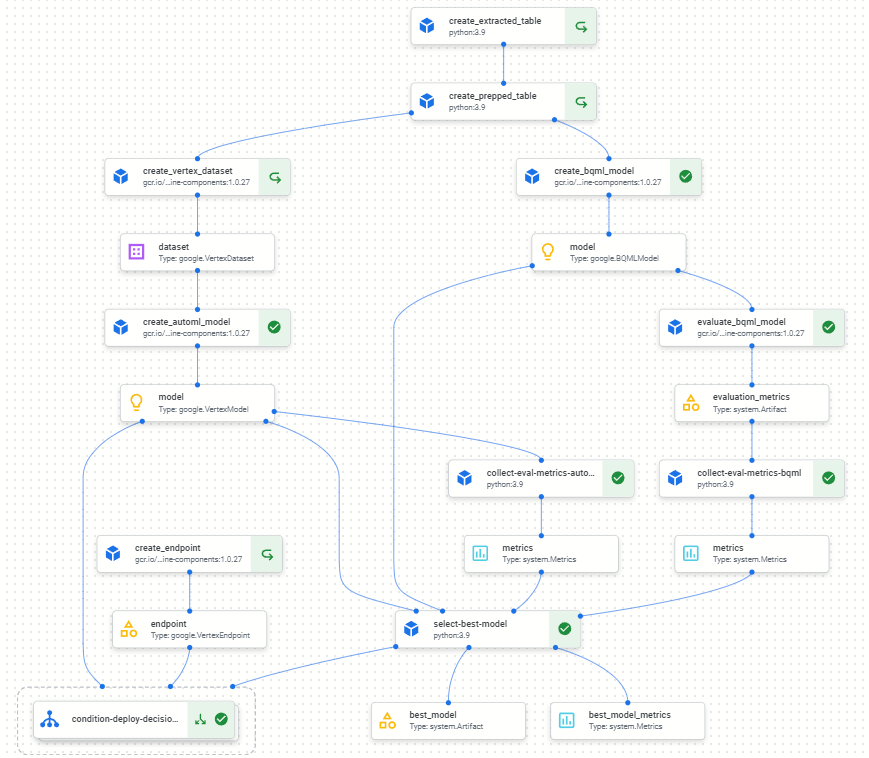

# Production-Ready ML Pipeline on GCP: Baby Weight Prediction
In this project, I developed a completed Vertex and Kubeflow pipelines SDK to build and deploy an AutoML / BigQuery ML regression model for online predictions. Using this ML Pipeline, we were able to develop, deploy, and manage the _production_ ML lifecycle efficiently and reliably.

* As part of this project, I used the Natality dataset, a public dataset available in BigQuery that provides information on US births from 1969 to 2008. 

* The trained AutoML/BQML models predicted the weight of newborns. The predicted values would be used in order to provide care for the newborns.

* At the end, a streamlit application is then created to show how the model can interact with a web application to provide online predictions.

## Streamlit App for Online Predictions

## Vertex AI Pipeline Structure
---------------------

