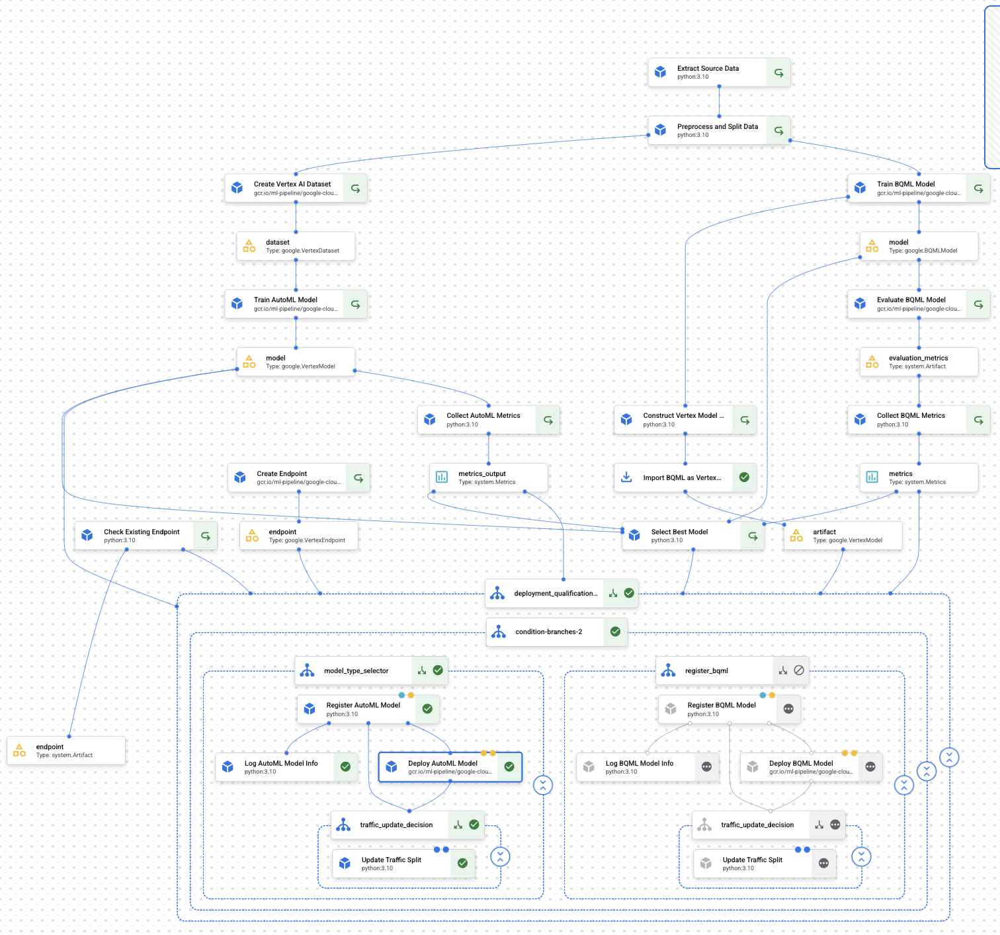

# Production-Ready ML Pipeline on GCP: Baby Weight Prediction

## Overview
This project delivers a production-grade MLOps solution on Google Cloud Platform (GCP) for baby weight prediction, using the Vertex AI platform and Kubeflow Pipelines. The implementation showcases a complete ML workflow with robust governance, intelligent deployment strategies, and operational excellence.

The solution addresses critical challenges in healthcare prediction by leveraging:

- **Natality Dataset**: A comprehensive public dataset from BigQuery containing US birth information from 1969-2008
- **Dual Modeling Approach**: Parallel BQML and AutoML training for framework diversity and performance optimization
- **Intelligent Deployment**: Automated model selection, endpoint management, and traffic control
- **Interactive Predictions**: A modern Streamlit web application for healthcare professionals

## Interactive Prediction Application

## Pipeline Architecture
The end-to-end MLOps pipeline orchestrates the entire machine learning lifecycle:

## CI/CD Pipeline
The project includes a fully automated CI/CD pipeline using:

- **Infrastructure as Code**: Terraform configuration for all GCP resources
- **Containerization**: Docker images stored in Artifact Registry
- **Continuous Integration**: Cloud Build triggers for automated builds
- **Continuous Deployment**: Automated deployment to Cloud Run
- **Environment Separation**: Separate pipelines for development and production
- **IAM Security**: Proper service account permissions for secure deployments

The CI/CD workflow automatically builds and deploys the Streamlit application when changes are pushed to the repository, ensuring consistent and reliable deployments.

## Key Production Features

### 1. Dual-Model Training & Evaluation
- **Parallel Processing**: Simultaneous training of BigQuery ML and AutoML models
- **Framework Diversity**: Reduces model failure risk through diverse approaches
- **Standardized Metrics**: Common evaluation framework for fair comparison

### 2. Intelligent Model Selection
- **Automated Comparison**: Configurable metrics-based selection (MAE, RMSE, R²)
- **Threshold-Based Deployment**: Models deploy only when meeting quality thresholds
- **Comprehensive Logging**: Full transparency for model selection decisions

### 3. Enterprise Endpoint Management
- **Endpoint Detection**: Checks for existing endpoints before creating new ones
- **Resource Conservation**: Prevents endpoint proliferation in production
- **Simplified Operations**: Reduces maintenance overhead for DevOps teams

### 4. Model Registry Integration
- **Version Control**: Complete model lineage with metadata tracking
- **Governance Support**: Compliance documentation for regulatory requirements
- **Deployment History**: Audit trail of all model deployments

### 5. Production Traffic Management
- **Gradual Rollout**: Controlled traffic shifting to new model versions
- **Blue/Green Deployment**: Support for zero-downtime deployment strategies
- **Rollback Capability**: Quick recovery options if issues are detected

### 6. Operational Excellence
- **Efficient Caching**: Optimized resource usage through Vertex Pipeline caching
- **Comprehensive Error Handling**: Robust exception management at each stage
- **Detailed Logging**: Complete observability throughout the pipeline

## Technical Implementation

The pipeline orchestrates these key stages:

1. **Data Engineering**: Extract source data from BigQuery and prepare for modeling
2. **Parallel Model Development**: Train both BQML and AutoML models concurrently
3. **Standardized Evaluation**: Apply consistent metrics across both model types
4. **Performance Analysis**: Select optimal model based on configurable criteria
5. **Model Registration**: Store model artifacts with complete metadata
6. **Deployment Orchestration**: Manage endpoints and model serving
7. **Traffic Control**: Configure traffic allocation for production models

## Business Benefits

This MLOps solution delivers significant advantages for healthcare organizations:

1. **Reduced TCO**: Optimized resource usage through intelligent endpoint management
2. **Accelerated Innovation**: Faster model iterations with parallel training and caching
3. **Risk Mitigation**: Enhanced reliability through framework diversity and traffic control
4. **Compliance Support**: Comprehensive model registry and versioning for regulatory needs
5. **Operational Simplification**: Automated deployment decisions and endpoint management
6. **Quality Assurance**: Threshold-based deployment ensures performance standards

## Documentation

For detailed component information, refer to the [pipeline documentation](pipeline.md).

